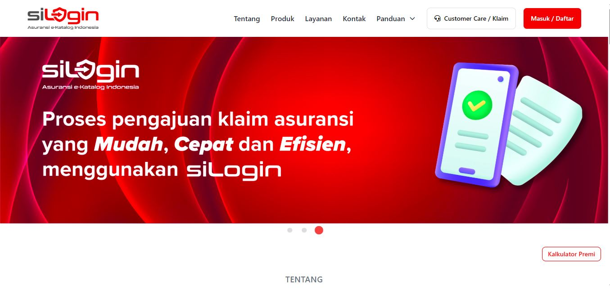

# 🌐 SiLogin - Landing Page

**SiLogin** adalah landing page interaktif yang dibangun menggunakan React + Vite + TailwindCSS + DaisyUI. Proyek ini bertujuan untuk memberikan antarmuka modern, ringan, dan mobile-friendly bagi pengguna untuk memahami fitur-fitur layanan SiLogin.

---

## 🖼️ Cuplikan Tampilan



---

## 🚀 Fitur Utama

- 🎯 Menyajikan informasi manfaat layanan secara visual dan terstruktur
- 🎨 Desain responsif dengan Tailwind CSS v3 + DaisyUI v4
- 📱 Kompatibel di berbagai perangkat (mobile, tablet, desktop)
- ⚡ Performa tinggi dengan React 18 + Vite 5
- 🧭 Navigasi interaktif dengan React Router DOM v7
- 🎞️ Carousel produk menggunakan React Slick
- 🧩 Komponen modular untuk skalabilitas proyek
- 💬 Notifikasi interaktif dengan SweetAlert2
- 🎛️ Dropdown stylish dengan React Select
- 🌈 Animasi halus menggunakan Framer Motion

---

## 🛠️ Teknologi yang Digunakan

- ⚛️ **React 18** – library utama untuk UI komponen
- ⚡ **Vite 5** – bundler modern dengan performa tinggi
- 💨 **Tailwind CSS v3** – utility-first CSS framework
- 🌸 **DaisyUI v4** – komponen UI siap pakai berbasis Tailwind
- 🧭 **React Router v7** – navigasi single-page application
- 🌀 **React Slick** – carousel/slider dinamis
- 🎛️ **React Select** – komponen select yang fleksibel dan elegan
- 🎨 **FontAwesome** – ikon modern dari `@fortawesome/fontawesome-free`
- 🎉 **SweetAlert2** – popup dan notifikasi stylish
- 🎬 **Framer Motion** – animasi responsif dan intuitif
- 📦 **ESLint 9** – menjaga kualitas dan konsistensi kode

---

## 📦 Cara Install dan Menjalankan Project

```bash
# 1. Clone repository
git clone https://github.com/Julls31/silogin.git
cd silogin

# 2. Install dependencies
npm install

# 3. Jalankan project
npm run dev
```

## 📁 Struktur Folder
```bash
public/  
  Image/       # Gambar konten visual  
  readme/      # Gambar untuk dokumentasi README  
  
src/  
  components/  # Komponen UI terpisah  
  layout/      # Struktur layout global (Navbar, Footer)  
  pages/       # Halaman utama  
  ```
  
## ✍️ Author

**Jullyandre Fazri**  
**📧 Email**: jullyandrefazry@gmail.com  